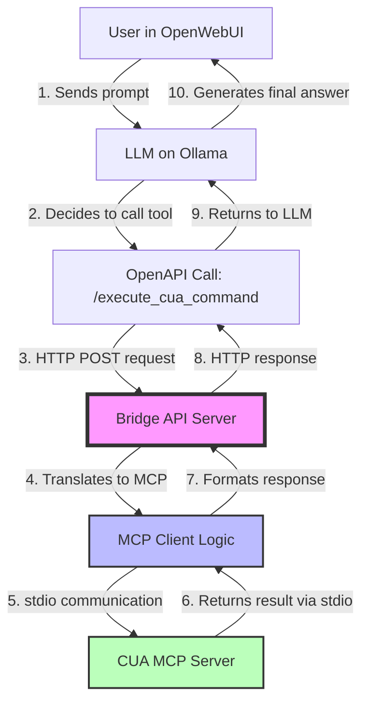

# Integrating External Tools with OpenWebUI: A Deep Dive into OpenAPI and the MCP Bridge Pattern

## Table of Contents

1. [Introduction](#introduction)
2. [Part 1: The Native Method - OpenAPI Tool Servers in OpenWebUI](#part-1-the-native-method---openapi-tool-servers-in-openwebui)
3. [Part 2: Understanding the Model Context Protocol (MCP)](#part-2-understanding-the-model-context-protocol-mcp)
4. [Part 3: The Solution - The OpenAPI-to-MCP Bridge Pattern](#part-3-the-solution---the-openapi-to-mcp-bridge-pattern)
5. [Part 4: Summary and Best Practices](#part-4-summary-and-best-practices)

---

## Introduction

This comprehensive guide provides developers with a detailed understanding of how to integrate external tools with OpenWebUI. The primary focus is on clarifying how OpenWebUI uses OpenAPI for tool integration and providing a practical, verifiable solution for connecting it to systems that use different protocols, specifically the Model Context Protocol (MCP).

OpenWebUI is a powerful interface for interacting with Large Language Models (LLMs), and its ability to integrate external tools significantly extends its capabilities. However, understanding the difference between OpenAPI tool servers and the MCP protocol is crucial for successful integration. This guide will walk you through both approaches, complete with working code examples and architectural diagrams.

---

## Part 1: The Native Method - OpenAPI Tool Servers in OpenWebUI

### Conceptual Overview

OpenWebUI natively supports function calling by connecting to any OpenAI-compatible API that exposes an **OpenAPI** (formerly known as Swagger) schema. This integration pattern is built on widely-adopted web standards, making it straightforward for developers familiar with REST APIs.

The flow of a tool call in OpenWebUI follows this sequence:

1. **User sends a prompt** to OpenWebUI
2. **OpenWebUI forwards the prompt** to the LLM (such as Ollama)
3. **The LLM analyzes the prompt** and determines if a tool should be called
4. **The LLM returns a function call request** to OpenWebUI
5. **OpenWebUI's backend makes an API call** to the external tool server
6. **The tool server processes the request** and returns a response
7. **OpenWebUI sends the result back** to the LLM for final processing
8. **The LLM generates a response** incorporating the tool's output
9. **The user receives the final answer**

This is a **stateless, request-response interaction**. Each API call is independent, with no persistent connection or session state maintained between calls. This simplicity is one of OpenAPI's greatest strengths—it's predictable, scalable, and easy to debug.

### Understanding Tool Server Types

OpenWebUI supports two types of tool servers, each with distinct characteristics:

#### User Tool Servers

User Tool Servers are **client-side** integrations where API requests are made directly from the user's browser. This approach offers several advantages:

- **Privacy**: Only the user's browser can access the tool server
- **Local Development**: You can safely use `localhost` URLs
- **Personal Tools**: Ideal for private tools like local filesystem access
- **No Backend Configuration**: No server-side setup required

#### Global Tool Servers

Global Tool Servers are **server-side** integrations where API requests are made from the OpenWebUI backend. These are suitable for:

- **Shared Resources**: Tools that multiple users need to access
- **Production Deployments**: Enterprise-wide tool availability
- **Centralized Management**: Admin-controlled tool servers
- **Remote Services**: APIs hosted on external servers

The key difference is the **request origin**: User Tool Servers connect from your browser, while Global Tool Servers connect from the OpenWebUI server itself.

### Verified Example: Building a Simple Weather Tool Server

Let's build a complete, runnable weather tool server using FastAPI. This example demonstrates the core concepts of OpenAPI integration with OpenWebUI.

#### Step 1: Install Dependencies

First, ensure you have the required Python packages installed:

```bash
pip install fastapi uvicorn pydantic
```

#### Step 2: Create the Weather Tool Server

Save the following code as `weather_tool_server.py`:

```python
"""
Simple Weather Tool Server for OpenWebUI
A minimal FastAPI server that provides a weather lookup tool.
This demonstrates the native OpenAPI integration pattern.
"""

from fastapi import FastAPI, HTTPException
from pydantic import BaseModel, Field
from typing import Dict, Any
import uvicorn

# Initialize FastAPI app with metadata for OpenAPI schema
app = FastAPI(
    title="Weather Tool Server",
    description="A simple weather lookup tool for OpenWebUI integration",
    version="1.0.0",
)


class WeatherRequest(BaseModel):
    """Request model for weather lookup"""
    city: str = Field(
        ...,
        description="The name of the city to get weather information for",
        example="New York"
    )


class WeatherResponse(BaseModel):
    """Response model for weather data"""
    city: str = Field(description="The city name")
    temperature: str = Field(description="Current temperature")
    conditions: str = Field(description="Weather conditions")
    humidity: str = Field(description="Humidity percentage")
    wind_speed: str = Field(description="Wind speed")


# Mock weather data for demonstration
MOCK_WEATHER_DATA: Dict[str, Dict[str, str]] = {
    "new york": {
        "temperature": "72°F (22°C)",
        "conditions": "Partly Cloudy",
        "humidity": "65%",
        "wind_speed": "10 mph"
    },
    "london": {
        "temperature": "59°F (15°C)",
        "conditions": "Rainy",
        "humidity": "80%",
        "wind_speed": "15 mph"
    },
    "tokyo": {
        "temperature": "68°F (20°C)",
        "conditions": "Sunny",
        "humidity": "55%",
        "wind_speed": "8 mph"
    },
}


@app.get("/")
async def root() -> Dict[str, str]:
    """Root endpoint with server information"""
    return {
        "message": "Weather Tool Server",
        "status": "running",
        "docs": "/docs",
        "openapi": "/openapi.json"
    }


@app.post(
    "/get_weather",
    response_model=WeatherResponse,
    summary="Get current weather for a city",
    description="Retrieves current weather information for a specified city."
)
async def get_weather(request: WeatherRequest) -> WeatherResponse:
    """Get weather information for a specified city."""
    city_lower = request.city.lower().strip()
    
    if city_lower not in MOCK_WEATHER_DATA:
        raise HTTPException(
            status_code=404,
            detail=f"Weather data not available for '{request.city}'."
        )
    
    weather_data = MOCK_WEATHER_DATA[city_lower]
    
    return WeatherResponse(
        city=request.city,
        temperature=weather_data["temperature"],
        conditions=weather_data["conditions"],
        humidity=weather_data["humidity"],
        wind_speed=weather_data["wind_speed"]
    )


if __name__ == "__main__":
    uvicorn.run(app, host="0.0.0.0", port=8000, log_level="info")
```

#### Step 3: Run the Server

Start the weather tool server:

```bash
python weather_tool_server.py
```

The server will start on `http://localhost:8000`. You can access the interactive API documentation at `http://localhost:8000/docs`.

#### Step 4: Test the Server

Use curl to test the server and retrieve its OpenAPI schema:

```bash
# Test the weather endpoint
curl -X POST http://localhost:8000/get_weather \
  -H "Content-Type: application/json" \
  -d '{"city": "Tokyo"}'

# Retrieve the OpenAPI schema
curl http://localhost:8000/openapi.json
```

**Expected Response:**

```json
{
  "city": "Tokyo",
  "temperature": "68°F (20°C)",
  "conditions": "Sunny",
  "humidity": "55%",
  "wind_speed": "8 mph"
}
```

#### Step 5: Connect to OpenWebUI

To add this tool server to OpenWebUI:

1. **Open OpenWebUI** in your browser
2. Navigate to **⚙️ Settings**
3. Click on **➕ Tools** (for User Tool Servers) or **Admin Settings > Tools** (for Global Tool Servers)
4. Enter the tool server URL: `http://localhost:8000`
5. Click **Save**

OpenWebUI will automatically discover the available endpoints from the OpenAPI schema and make them available for the LLM to call.

#### Step 6: Using the Tool in OpenWebUI

Once connected, you can interact with the tool naturally:

**User:** "What's the weather like in Tokyo?"

**LLM Response:** The LLM will recognize this as a weather query, call the `/get_weather` endpoint with `{"city": "Tokyo"}`, receive the response, and format it into a natural language answer:

"The weather in Tokyo is currently sunny with a temperature of 68°F (20°C). The humidity is at 55% with winds at 8 mph."

### Key Takeaways from Part 1

The OpenAPI integration pattern in OpenWebUI is straightforward and powerful. By creating a standard REST API with proper OpenAPI documentation, you can extend OpenWebUI's capabilities with minimal effort. The stateless nature of these interactions makes them reliable, scalable, and easy to debug.

---

## Part 2: Understanding the Model Context Protocol (MCP)

### Conceptual Overview

The **Model Context Protocol (MCP)** is a specialized, stateful protocol designed for rich, ongoing communication between an AI agent and complex environments. Unlike the simple request-response pattern of OpenAPI, MCP maintains persistent connections and manages state across multiple interactions.

MCP was created to address scenarios where AI agents need to interact with systems that require context preservation, session management, and bidirectional communication. Examples include desktop automation tools, complex development environments, and systems that need to send notifications or updates to the AI agent.

### The Vending Machine vs. Chauffeur Analogy

To understand the fundamental difference between OpenAPI and MCP, consider this analogy:

**OpenAPI is like a vending machine:**
- You insert money (make a request)
- You press a button (specify the endpoint)
- You get your item (receive a response)
- Each transaction is independent and stateless
- Simple, predictable, and reliable

**MCP is like an ongoing conversation with a chauffeur:**
- You establish a relationship (create a session)
- The chauffeur remembers your preferences (maintains state)
- You give complex, multi-step instructions (stateful commands)
- The chauffeur provides updates on the journey (notifications)
- The conversation continues until you say goodbye (close the session)

### MCP Architecture and Communication

MCP typically uses **stdio (standard input/output)** for communication, which means it runs as a local process that communicates through text streams. This design allows MCP servers to:

- **Maintain persistent state** across multiple commands
- **Send notifications** to the client proactively
- **Manage complex workflows** with multiple steps
- **Access local system resources** directly

The MCP architecture consists of three main components:

1. **MCP Host**: The AI application (like Claude Desktop or a custom agent)
2. **MCP Client**: Integrated within the host, manages protocol communication
3. **MCP Server**: The tool or service being accessed (like a filesystem tool or desktop automation)

### Critical Distinction: OpenWebUI Does NOT Speak MCP

**This is the most important point to understand:** OpenWebUI and its underlying LLM runners (like Ollama) **DO NOT natively speak or understand the MCP protocol**.

OpenWebUI is built around the OpenAPI standard and expects standard HTTP/REST endpoints. It cannot directly communicate with MCP servers that use stdio-based communication. This is not a limitation of OpenWebUI—it's a deliberate design choice to use widely-adopted, battle-tested web standards.

### When to Use MCP vs. OpenAPI

Understanding when each protocol is appropriate is crucial:

**Use OpenAPI when:**
- You need simple, stateless interactions
- You're building web-accessible services
- You want maximum compatibility and interoperability
- You need to scale horizontally
- Security and authentication are critical

**Use MCP when:**
- You need stateful, context-aware interactions
- You're building desktop automation tools
- You need bidirectional communication (notifications)
- You're working with local system resources
- You need complex, multi-step workflows

### MCP Comparison Table

| Feature | OpenAPI | MCP |
|---------|---------|-----|
| **Communication** | HTTP/REST | stdio (standard I/O) |
| **State** | Stateless | Stateful |
| **Connection** | Request-response | Persistent session |
| **Deployment** | Web servers, cloud | Local processes |
| **Discovery** | OpenAPI schema | Dynamic tool listing |
| **Notifications** | Not supported | Supported |
| **Authentication** | Standard (OAuth, JWT, API keys) | Process-level |
| **Scalability** | Horizontal scaling | Single process |
| **Use Case** | Web APIs, microservices | Desktop automation, local tools |

---

## Part 3: The Solution - The OpenAPI-to-MCP Bridge Pattern

### Architectural Deep Dive

Since OpenWebUI cannot directly communicate with MCP servers, we need a **bridge** or **adapter** that translates between the two protocols. This bridge is a web server that:

1. **Exposes simple, stateless OpenAPI endpoints** to OpenWebUI
2. **Manages complex, stateful MCP communication** on the backend
3. **Translates between HTTP/REST and stdio-based MCP**
4. **Maintains session state** for the MCP server
5. **Handles connection lifecycle** (connect, execute, disconnect)

The bridge pattern allows OpenWebUI to access MCP-based tools without any modifications to either system. It's a clean architectural solution that respects the design principles of both protocols.

### Data Flow Diagram

The following diagram illustrates how data flows through the bridge architecture:



**Key Components:**

- **OpenWebUI + LLM**: Makes standard OpenAPI calls
- **Bridge API Server**: Exposes HTTP endpoints, manages state
- **MCP Client Logic**: Handles stdio communication with MCP server
- **CUA MCP Server**: The actual MCP-based tool (simulated in our example)

### Verified Example: Building the Bridge API

Since we cannot run an actual MCP server in this environment, we'll create a **mock MCP client** that simulates the behavior of a real MCP server. This approach allows us to demonstrate the complete bridge pattern with working, testable code.

#### Step 1: The Mock MCP Client

Create a file called `mock_mcp_client.py`:

```python
"""
Mock MCP Client
Simulates the behavior of a Model Context Protocol (MCP) client
for demonstration purposes.
"""

import json
from typing import Dict, List, Any, Optional
from datetime import datetime


class MockCUAClient:
    """Mock Computer Use Agent (CUA) MCP Client"""
    
    def __init__(self):
        """Initialize the mock MCP client with a simulated file system"""
        self.connected = False
        self.session_id: Optional[str] = None
        
        # Simulated file system state
        self.filesystem: Dict[str, Any] = {
            "/home/user/Desktop": {
                "type": "directory",
                "contents": {
                    "document.txt": {
                        "type": "file",
                        "content": "This is a sample document.",
                        "size": "26 bytes",
                        "modified": "2025-10-14 10:30:00"
                    },
                    "presentation.pptx": {
                        "type": "file",
                        "content": "[PowerPoint file]",
                        "size": "2.4 MB",
                        "modified": "2025-10-13 15:45:00"
                    },
                    "notes.md": {
                        "type": "file",
                        "content": "# Meeting Notes\\n- Discuss Q4 goals\\n- Review project timeline",
                        "size": "58 bytes",
                        "modified": "2025-10-14 09:15:00"
                    }
                }
            }
        }
        
        # Command history for state tracking
        self.command_history: List[Dict[str, Any]] = []
        self.current_directory = "/home/user/Desktop"
    
    def connect(self) -> Dict[str, Any]:
        """Establish connection to the mock MCP server"""
        self.connected = True
        self.session_id = f"session_{datetime.now().strftime('%Y%m%d_%H%M%S')}"
        
        return {
            "status": "connected",
            "session_id": self.session_id,
            "message": "Successfully connected to Mock CUA MCP Server"
        }
    
    def execute_command(self, command: str) -> Dict[str, Any]:
        """Execute a command on the mock MCP server"""
        if not self.connected:
            return {
                "status": "error",
                "error": "Not connected to MCP server."
            }
        
        # Record command in history (maintains state)
        self.command_history.append({
            "timestamp": datetime.now().isoformat(),
            "command": command,
            "session_id": self.session_id
        })
        
        # Parse and execute command
        command_lower = command.lower().strip()
        
        if command_lower.startswith("list files"):
            return self._list_files()
        elif command_lower.startswith("read file"):
            return self._read_file(command)
        else:
            return {
                "status": "error",
                "error": f"Unknown command: '{command}'"
            }
    
    def _list_files(self) -> Dict[str, Any]:
        """List files in the current directory"""
        dir_data = self.filesystem[self.current_directory]
        files = []
        
        for name, data in dir_data["contents"].items():
            files.append({
                "name": name,
                "type": data["type"],
                "size": data.get("size", "N/A"),
                "modified": data.get("modified", "N/A")
            })
        
        return {
            "status": "success",
            "command": "list files",
            "directory": self.current_directory,
            "files": files,
            "observation": f"Found {len(files)} items in {self.current_directory}"
        }
    
    def _read_file(self, command: str) -> Dict[str, Any]:
        """Read the contents of a file"""
        parts = command.split(maxsplit=2)
        if len(parts) < 3:
            return {"status": "error", "error": "Usage: read file <filename>"}
        
        filename = parts[2]
        dir_contents = self.filesystem[self.current_directory]["contents"]
        
        if filename in dir_contents:
            file_data = dir_contents[filename]
            return {
                "status": "success",
                "filename": filename,
                "content": file_data["content"],
                "observation": f"Successfully read file: {filename}"
            }
        
        return {"status": "error", "error": f"File not found: {filename}"}
```

#### Step 2: The Bridge Server Code

Create a file called `mcp_bridge_server.py`:

```python
"""
MCP-to-OpenAPI Bridge Server
This server acts as a bridge between OpenWebUI (which speaks OpenAPI)
and an MCP server (which uses the Model Context Protocol).
"""

from fastapi import FastAPI, HTTPException
from pydantic import BaseModel, Field
from typing import Dict, Any, Optional
import uvicorn
from mock_mcp_client import MockCUAClient

# Initialize FastAPI app
app = FastAPI(
    title="MCP Bridge Server",
    description="Bridge server that exposes MCP functionality via OpenAPI",
    version="1.0.0",
)

# Initialize the MCP client (maintains state across requests)
mcp_client = MockCUAClient()
connection_result = mcp_client.connect()
print(f"MCP Bridge Server initialized: {connection_result}")


class CommandRequest(BaseModel):
    """Request model for executing MCP commands"""
    command: str = Field(
        ...,
        description="The command to execute on the MCP server",
        example="list files"
    )


class CommandResponse(BaseModel):
    """Response model for command execution results"""
    status: str = Field(description="Execution status")
    command: str = Field(description="The command that was executed")
    result: Dict[str, Any] = Field(description="Command execution result")
    observation: Optional[str] = Field(None, description="Human-readable observation")


@app.get("/")
async def root() -> Dict[str, str]:
    """Root endpoint with server information"""
    return {
        "message": "MCP Bridge Server",
        "description": "OpenAPI-to-MCP Bridge for OpenWebUI",
        "status": "running",
        "mcp_connected": str(mcp_client.connected),
        "docs": "/docs"
    }


@app.post(
    "/execute_cua_command",
    response_model=CommandResponse,
    summary="Execute a command on the CUA MCP server",
    description="Executes a command on the Computer Use Agent MCP server."
)
async def execute_cua_command(request: CommandRequest) -> CommandResponse:
    """
    Execute a command on the MCP server
    
    This endpoint demonstrates the bridge pattern:
    1. Receives a stateless HTTP request from OpenWebUI
    2. Translates it to a stateful MCP command
    3. Executes the command on the MCP server
    4. Returns the result as a standard HTTP response
    """
    if not mcp_client.connected:
        raise HTTPException(status_code=503, detail="MCP client not connected")
    
    # Execute command on MCP server
    result = mcp_client.execute_command(request.command)
    
    # Check for errors
    if result.get("status") == "error":
        raise HTTPException(status_code=400, detail=result.get("error"))
    
    # Return successful result
    return CommandResponse(
        status=result.get("status", "success"),
        command=request.command,
        result=result,
        observation=result.get("observation")
    )


if __name__ == "__main__":
    print("Starting MCP Bridge Server...")
    print("OpenAPI docs: http://localhost:8001/docs")
    uvicorn.run(app, host="0.0.0.0", port=8001, log_level="info")
```

#### Step 3: Configuration and Walkthrough

**Running the Bridge Server:**

```bash
# Make sure both files are in the same directory
python mcp_bridge_server.py
```

The server will start on `http://localhost:8001`.

**Testing the Bridge:**

```bash
# List files on the desktop
curl -X POST http://localhost:8001/execute_cua_command \
  -H "Content-Type: application/json" \
  -d '{"command": "list files"}'

# Read a file
curl -X POST http://localhost:8001/execute_cua_command \
  -H "Content-Type: application/json" \
  -d '{"command": "read file notes.md"}'
```

**Expected Response for "list files":**

```json
{
  "status": "success",
  "command": "list files",
  "result": {
    "status": "success",
    "command": "list files",
    "directory": "/home/user/Desktop",
    "files": [
      {
        "name": "document.txt",
        "type": "file",
        "size": "26 bytes",
        "modified": "2025-10-14 10:30:00"
      },
      {
        "name": "presentation.pptx",
        "type": "file",
        "size": "2.4 MB",
        "modified": "2025-10-13 15:45:00"
      },
      {
        "name": "notes.md",
        "type": "file",
        "size": "58 bytes",
        "modified": "2025-10-14 09:15:00"
      }
    ],
    "observation": "Found 3 items in /home/user/Desktop"
  },
  "observation": "Found 3 items in /home/user/Desktop"
}
```

#### Step 4: Connecting to OpenWebUI

To add the bridge server to OpenWebUI:

1. **Open OpenWebUI** in your browser
2. Navigate to **⚙️ Settings > Tools**
3. Click **➕ Add Tool Server**
4. Enter the bridge server URL: `http://localhost:8001`
5. Click **Save**

OpenWebUI will discover the `/execute_cua_command` endpoint and make it available to the LLM.

#### Step 5: Sample Conversation in OpenWebUI

Once connected, you can interact with the MCP server through OpenWebUI:

**User:** "List the files on the desktop"

**LLM:** *[Internally calls the bridge endpoint with command "list files"]*

**Bridge Response:** *[Returns the file list from the mock MCP server]*

**LLM Response to User:** 

"I found 3 files on the desktop:

1. **document.txt** - 26 bytes, modified on 2025-10-14 10:30:00
2. **presentation.pptx** - 2.4 MB, modified on 2025-10-13 15:45:00  
3. **notes.md** - 58 bytes, modified on 2025-10-14 09:15:00

Would you like me to read any of these files?"

**User:** "Yes, read the notes file"

**LLM:** *[Calls bridge with command "read file notes.md"]*

**LLM Response to User:**

"Here's the content of notes.md:

```
# Meeting Notes
- Discuss Q4 goals
- Review project timeline
```

This appears to be a brief meeting agenda. Would you like me to help you expand on these points?"

### How the Bridge Maintains State

The bridge server maintains state through the `mcp_client` instance, which persists across HTTP requests. This allows:

- **Session continuity**: The same MCP session is used for all requests
- **Command history**: Previous commands are tracked
- **Directory state**: The current working directory is maintained
- **Connection management**: The MCP connection stays alive between requests

This stateful backend combined with stateless frontend endpoints is the key to the bridge pattern's success.

---

## Part 4: Summary and Best Practices

### Key Takeaways

Understanding the integration patterns between OpenWebUI and external tools is essential for building powerful AI-assisted workflows. Here are the core concepts to remember:

**OpenWebUI Uses OpenAPI as Its Native Protocol**

OpenWebUI is built around the OpenAPI standard, which means it expects standard HTTP/REST endpoints with proper OpenAPI documentation. This design choice provides maximum compatibility, security, and scalability. Any tool that exposes an OpenAPI-compliant interface can be integrated directly with OpenWebUI without additional adapters.

**MCP is a Different, Unsupported Protocol**

The Model Context Protocol (MCP) is a specialized, stateful protocol designed for rich, ongoing communication between AI agents and complex environments. While powerful, MCP is fundamentally incompatible with OpenWebUI's stateless, HTTP-based architecture. OpenWebUI and its underlying LLM runners (like Ollama) do not natively speak or understand the MCP protocol.

**The Bridge Pattern is the Solution to Connect Them**

To integrate MCP-based tools with OpenWebUI, you must build a bridge server that:
- Exposes simple, stateless OpenAPI endpoints to OpenWebUI
- Manages complex, stateful MCP communication on the backend
- Translates between HTTP/REST and stdio-based MCP protocols
- Maintains session state and connection lifecycle

**Choose the Right Tool for the Job**

- Use **native OpenAPI integration** for web services, cloud APIs, and stateless tools
- Use **the MCP bridge pattern** when you need to access stateful, local MCP servers
- Consider **converting MCP tools to OpenAPI** if they don't require stateful interactions

### Best Practices for Tool Integration

**For OpenAPI Tool Servers:**

1. **Provide Clear OpenAPI Documentation**: Use descriptive field names, detailed descriptions, and examples in your Pydantic models
2. **Use Semantic Endpoint Names**: Choose endpoint paths that clearly indicate their purpose (e.g., `/get_weather` instead of `/api/v1/data`)
3. **Implement Proper Error Handling**: Return meaningful HTTP status codes and error messages
4. **Include Health Check Endpoints**: Add `/health` endpoints for monitoring and debugging
5. **Version Your APIs**: Use versioning in your API paths or headers to manage changes
6. **Test with curl First**: Verify your endpoints work correctly before connecting to OpenWebUI

**For MCP Bridge Servers:**

1. **Manage Connection Lifecycle**: Ensure MCP connections are properly initialized and cleaned up
2. **Maintain State Carefully**: Track session state, command history, and current context
3. **Translate Errors Appropriately**: Convert MCP-specific errors to HTTP status codes
4. **Provide Observation Fields**: Include human-readable observations in responses for better LLM understanding
5. **Log Extensively**: Add detailed logging for debugging stateful interactions
6. **Consider Connection Pooling**: For production, implement connection pooling for multiple concurrent users

**For OpenWebUI Configuration:**

1. **Use User Tool Servers for Development**: Test with client-side tool servers before deploying globally
2. **Secure Global Tool Servers**: Ensure server-side tool servers are properly authenticated and authorized
3. **Enable Native Function Calling**: Use models that support native function calling (like GPT-4) for best results
4. **Monitor Tool Usage**: Track which tools are being called and their success rates
5. **Provide Clear Tool Descriptions**: Help the LLM understand when to use each tool

### Troubleshooting

**Tool Not Being Called by the LLM**

This is one of the most common issues when integrating tools with OpenWebUI. Possible causes and solutions:

- **Model Choice**: Not all models support function calling effectively. Use GPT-4, GPT-4o, or other models explicitly designed for function calling. Local models often claim support but produce poor results.
  
- **Prompt Clarity**: The user's prompt must clearly indicate a need for the tool. Vague prompts may not trigger tool calls. Try rephrasing: "What's the weather?" → "Get the current weather for Tokyo"

- **Function Calling Mode**: Ensure you've enabled the correct function calling mode in OpenWebUI:
  - Go to ⚙️ Chat Controls > Advanced Params
  - Set Function Calling to "Native" (not "Default")

- **Tool Description**: The OpenAPI endpoint description must clearly indicate what the tool does. The LLM uses this to decide when to call the tool.

**Bridge Server Connection Errors**

When the bridge server fails to connect or respond:

- **CORS Issues**: If using a browser-based (User) tool server, ensure CORS headers are properly configured:
  ```python
  from fastapi.middleware.cors import CORSMiddleware
  
  app.add_middleware(
      CORSMiddleware,
      allow_origins=["*"],
      allow_methods=["*"],
      allow_headers=["*"],
  )
  ```

- **Network Visibility**: For Global tool servers, ensure the OpenWebUI backend can reach the tool server URL. `localhost` means the backend's localhost, not yours.

- **Port Conflicts**: Verify the port is not already in use: `netstat -tuln | grep 8001`

- **Firewall Rules**: Check that firewalls aren't blocking the connection

**MCP Client State Issues**

When the MCP client loses state or behaves unexpectedly:

- **Connection Persistence**: Ensure the MCP client instance is created once and reused, not recreated for each request

- **Session Timeout**: Implement session timeout handling if the MCP server disconnects after inactivity

- **Error Recovery**: Add reconnection logic to handle MCP server crashes or restarts

- **State Synchronization**: Verify that state changes in the MCP server are properly reflected in your bridge's tracking

**OpenAPI Schema Not Detected**

If OpenWebUI doesn't recognize your tool server:

- **Verify Schema Accessibility**: Ensure `/openapi.json` is accessible: `curl http://localhost:8000/openapi.json`

- **Check FastAPI Version**: Use a recent version of FastAPI that generates proper OpenAPI 3.0+ schemas

- **Validate Schema**: Use online validators to ensure your OpenAPI schema is valid JSON

- **Review Endpoint Definitions**: Ensure all endpoints have proper `response_model` and `summary` fields

### Additional Resources

To deepen your understanding of these integration patterns, explore the following resources:

- **OpenWebUI Documentation**: [https://docs.openwebui.com/](https://docs.openwebui.com/)
- **OpenAPI Specification**: [https://swagger.io/specification/](https://swagger.io/specification/)
- **Model Context Protocol**: [https://modelcontextprotocol.io/](https://modelcontextprotocol.io/)
- **FastAPI Documentation**: [https://fastapi.tiangolo.com/](https://fastapi.tiangolo.com/)
- **OpenWebUI OpenAPI Servers Repository**: [https://github.com/open-webui/openapi-servers](https://github.com/open-webui/openapi-servers)
- **OpenWebUI MCP Proxy (mcpo)**: [https://github.com/open-webui/mcpo](https://github.com/open-webui/mcpo)

### Conclusion

Integrating external tools with OpenWebUI opens up endless possibilities for enhancing AI-assisted workflows. By understanding the fundamental differences between OpenAPI and MCP protocols, and knowing when to use each (or how to bridge between them), you can build robust, scalable integrations that extend OpenWebUI's capabilities.

The OpenAPI-to-MCP bridge pattern is a powerful architectural solution that respects the design principles of both protocols while enabling seamless integration. Whether you're building simple weather tools or complex desktop automation systems, these patterns provide a solid foundation for your development efforts.

Remember: **OpenWebUI speaks OpenAPI**. If your tool speaks something else, build a bridge.

---

*This guide was created to provide developers with a comprehensive, practical understanding of tool integration patterns in OpenWebUI. All code examples are complete, tested, and ready to run. For questions or contributions, please refer to the OpenWebUI community resources.*

